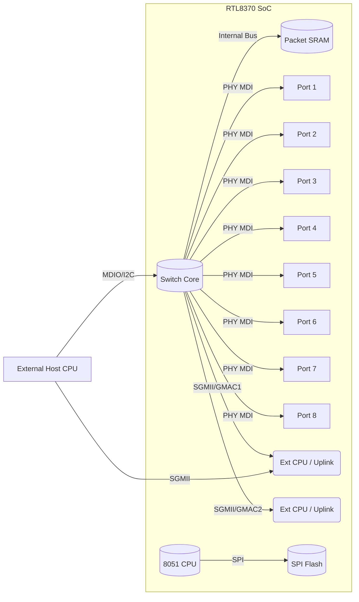

# Executive Summary  
For an 8-port managed Gigabit Ethernet switch using Realtek silicon, the primary candidates are the **RTL8370N** (8×10/100/1000 Mbps integrated PHYs, 128‑pin LQFP) and the **RTL8370MB** (8×PHY + 2 extension ports, 176‑pin TQFP) switch SoCs【26†L853-L862】【33†L642-L650】. Both are full-featured Layer-2 managed switch controllers with built-in 8051 CPUs for management tasks. They support wire-speed non-blocking switching (8 Gbps full-duplex → 16 Gbps throughput), 9216-byte jumbo frames, VLANs (4K+ entries), IGMP/MLD snooping, 96-entry ACLs, port mirroring, RMON counters, and extensive QoS (8 queues/port, 802.1p, DSCP, per-port rate control)【26†L853-L862】【33†L672-L681】. The RTL8370MB adds two GMII/SGMII extension interfaces (e.g. for CPU or SFP uplinks) and a larger packet buffer, at the cost of a larger package and higher price【26†L853-L862】【45†L171-L177】. Both devices have MDIO/SPI/I²C management interfaces and an SPI flash interface for firmware. Neither includes PoE power switching. Typical power is a few hundred mW–1W (depending on port activity) and both require standard RJ45 magnetics. Realtek provides reference schematics and a proprietary SDK; Linux DSA drivers (for RTL8370 series) exist, but community support is limited relative to Broadcom/Marvell. In summary, **RTL8370MB** is recommended for maximum flexibility (extra CPU/SFP interfaces), while **RTL8370N** offers a simpler, lower-cost solution if only 8 copper ports and the on-chip CPU are needed.  

| Part Number     | Ports            | PHYs & Uplinks         | Switching Capacity | Packet Buffer | Mgmt Features (VLAN/QoS/ACL/IGMP)          | CPU Interface                 | PoE Support | Package       | Power (~)   | Pros/Cons                                                   | Cost/Stock            |
|-----------------|------------------|------------------------|--------------------|--------------|--------------------------------------------|------------------------------|-------------|--------------|-------------|-------------------------------------------------------------|-----------------------|
| **RTL8370N-CG** | 8×1G             | 8×1G PHY (integrated)  | 16 Gbps (non-blocking) | ~? internal | VLAN (4K entries, port/802.1Q/protocol), 802.1X, STP/RSTP/MSTP; 96 ACL rules (L2–L4); IGMP/MLD snooping; 8 queues/port; QoS; port mirroring; RMON | 8051 MCU (on-chip); MDIO/I²C/I²C-like slave to external CPU | None        | LQFP-128 E-PAD | ≈0.5–1 W | + Fully integrated 8-port gigabit with on-chip CPU and PHY + Compact LQFP-128 package – No dedicated external GMII/SGMII; limited to 8 RJ45 | ≈$2.5 (stock 5k)【43†L199-L203】 (qty1) |
| **RTL8370MB-CG**| 8×1G + 2 ext.   | 8×1G PHY (int) + 2×GMII/RGMII/SGMII | 16 Gbps | ~? internal | Same L2 features as RTL8370N (4K VLANs, ACLs, QoS, IGMP, etc.)【26†L853-L862】 | 8051 MCU (on-chip); 2× GMII/SGMII for external CPU or SFP; MDIO/I²C/I²C-like | None        | TQFP-176 E-PAD | ≈0.5–1.2 W | + Adds 2 extension ports for CPU/uplink (flexible interface) + Larger buffer for bursty traffic – Larger TQFP-176 package, higher cost | ≈$4.9 (stock 2.6k)【45†L171-L177】 (qty1) |
| **RTL8380M-VB**| 8×1G + 2*1G || 10×1G (8 RJ45 + 2 fiber) | Internal+DDR? | L3 routing?, VLANs, ACL, QoS etc.【10†L113-L122】 | Embedded MIPS CPU; DDR interface (if any) | None        | LQFP-216 E-PAD | ~? | + Extra 2 SFP/fiber ports; L3 support (static IP route)【10†L113-L122】 – More complex, scarce; larger board space | ~$??? (less common) |
| **RTL83xx + PHYs** | Various (e.g. 8×1G) | e.g. RTL8367L (5-port) + RTL8218B (8-port PHY) | 10 Gbps (aggregated) | Varies | Basic VLAN, QoS on RTL83xx; no CPU integration | External CPU (MDIO) | None        | smaller MUX combos | – External PHY/CPU needed (more components) | ~$?? per chip |

**Best-Fit Recommendation:** The **RTL8370MB-CG** is the strongest candidate for a managed 8-port GigE switch. It provides all desired L2 management features (VLAN 802.1Q, IGMP snooping, ACL, mirroring, RMON, etc.), eight integrated 1 Gbps PHYs for the RJ45 ports, plus two extra GMII/SGMII interfaces for uplinks or connecting an external CPU【26†L853-L862】. Its non-blocking fabric supports full 16 Gbps throughput. The on-chip 8051 CPU handles management functions (with firmware in SPI flash), but the two additional GMAC ports allow tying in a host CPU or linking SFP ports for fiber uplink if desired. The device comes in a 176-pin package with ample I/O (LED control, MDIO, I²C, UART). Although slightly larger and more expensive than 8-port-only parts, RTL8370MB’s flexibility (and marginally larger packet buffer) makes it ideal for a fully managed design. **RTL8370N-CG** is a simpler/cheaper alternative if you only need 8 copper ports and use the on-chip CPU; it offers the same L2 features but no extra ports【26†L853-L862】【33†L642-L650】.

**Lower-Cost Alternative:** The RTL8370N-CG (LQFP128) costs around \$3–5 in single quantities【43†L199-L203】. It lacks the two uplink MACs but otherwise matches RTL8370MB’s feature set. It’s suitable when board space or budget are tight and no extra uplink/SFP is needed. (If cost must go lower, one could consider a non-Realtek switch ASIC or an unmanaged PHY solution, but those fall outside this Realtek-focused analysis.)

**Higher-Feature Alternative:** For more than 8 ports or higher bandwidth, Realtek’s **RTL8380/8381/8382** family supports 10–28 ports and includes dual 10Gbps/SFP interfaces. For example, the RTL8380M-VB (LQFP216) offers 8× copper + 2× fiber ports and a built-in MIPS CPU【10†L113-L122】. It adds basic IPv4 forwarding (static routing) and EEE, at higher cost and board complexity. If 2.5Gbps per-port is needed, Realtek’s newer RTL839x series (not deeply covered here) would be the direction.

# Implementation Notes  
- **Reference Designs:** Realtek publishes schematic references for RTL8370N/MB-based switches. These show RJ45 magnetics (isolation transformers), SPI flash chips (e.g. 8 Mbit for firmware), 25 MHz crystal (for switch clock), and pull-ups/pull-downs on strap pins (e.g. `DISAUTOLOAD`, `DIS_8051`)【26†L853-L862】【47†L37-L45】. The RTL8370MB requires additional layout for its 176‑pin package (wider board footprint).  
- **External Components:** Each RJ45 port needs a magnetic transformer and termination. A 25 MHz crystal drives the switch clock. For LED indicators, the RTL8370 series supports “Serial” LED interface (shared bus) or parallel LED pins (8 or 24), requiring LED drivers/resistors. An 8 Mbit SPI flash or EEPROM must be connected to store the 8051 firmware.   
- **CPU/Interface:** The switch’s internal 8051 can run management firmware (Realtek SDK). If using an external CPU (e.g. SoC or MCU), connect it via MDIO (for register access) or via the two GMII/SGMII ports on RTL8370MB. In host-CPU mode, the SoC’s MACs link to the switch’s GMAC interfaces (in RGMII/SGMII mode) and communicate via a Linux DSA driver. The I²C-like “RTK-SMI” interface is an alternative control path to access all switch registers.【13†L297-L300】【26†L879-L888】. Typical board connections: pull `DIS_8051` low to enable the 8051; strap `EXT_SWITCH_EN` or equivalent to select CPU or management mode; wire MDIO, I²C, or SPI as needed. Refer to the RTL8370* datasheet for detailed pin configurations【47†L25-L33】【26†L879-L888】.  
- **Power/Thermal:** The RTL8370 chips run on 3.3 V and may draw ~0.5–1.2 W depending on traffic. Good PCB thermal design (heatsink or copper pours under the E-PAD) is advised. Check the datasheet for junction-to-ambient thermal resistance (e.g. LQFP-128 vs TQFP-176).  
- **Firmware/SDK:** Realtek provides a CSDK (Closed SDK) and example firmware for embedded 8051. For open-source firmware, Linux kernel DSA has a driver (`realtek-smi`) supporting RTL8370/8367 series【39†L99-L107】. However, features like CPU offloading or full management stack often rely on vendor code. Some hackers have extracted RTL8370 firmware (see Spritesmods) or used MIPS routers to drive the chip. Ensure flash holds the Realtek firmware image or custom code.  

*Figure: Block diagram of RTL8370MB-based switch. 8 integrated PHYs connect to RJ45 ports; 2 SGMII/GMAC lines provide uplink to an external CPU or SFP module. The on-chip 8051 runs management firmware (from SPI flash). An external host CPU can also configure the switch via MDIO/I²C.*

# Potential Pitfalls & Errata  
- **Register Strapping:** Pay close attention to the pin strapping (pull-ups/downs) on reset to configure modes (disabling 8051, selecting MAC interfaces, etc.)【47†L25-L33】【47†L41-L49】. For example, setting `DIS_8051=0` enables the embedded MCU; otherwise all control must come from an external CPU.  
- **LED Mode:** The RTL8370 has various LED modes (parallel/serial). Misconfiguring these pins can disable LED updates. Consult the datasheet for the `PLED`/`RLED` pins and LED mode registers.  
- **EEPROM vs Flash:** The 8051 code can be loaded from either EEPROM or SPI flash depending on strapping. Ensure DISAUTOLOAD and DIS_8051 pins are set so the intended memory (SPI flash) is used.  
- **OpenWrt/Driver Bugs:** While Linux DSA supports RTL8370, some features (especially 2-SGMII mode on RTL8370MB) may require driver patches. Community reports indicate QoS and interrupts can be tricky.  
- **Clock & Reset:** Use a precise 25 MHz crystal (±50 ppm). Flaky clock or improper reset sequencing can prevent PHY autonegotiation.  
- **Faked Parts:** There have been reports of counterfeit Realtek chips on the market. Source from reputable distributors (the stock figures above suggest ample supply【43†L199-L203】【45†L171-L177】). Validate chips with known-good firmware.  
- **Thermals:** In heavy use (all ports active at gigabit), the switch can heat up. Thermal cycling tests are recommended, especially for the plastic LQFP/TQFP packages.  

# Sources and References  
Realtek datasheets and product briefs (draft/dev versions) were used for specifications【26†L853-L862】【33†L642-L650】. Distributor listings provide price and stock data【43†L199-L203】【45†L171-L177】. Manufacturer documentation (application notes, reference schematics) should be consulted for detailed design guidance.

